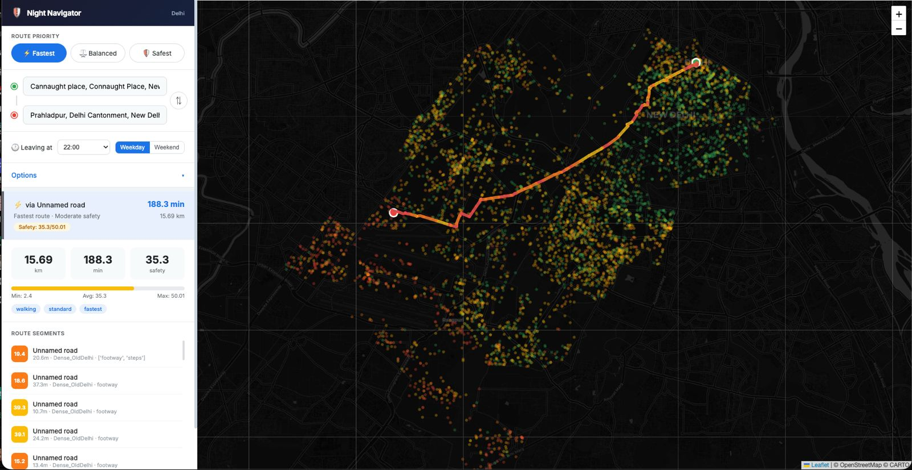
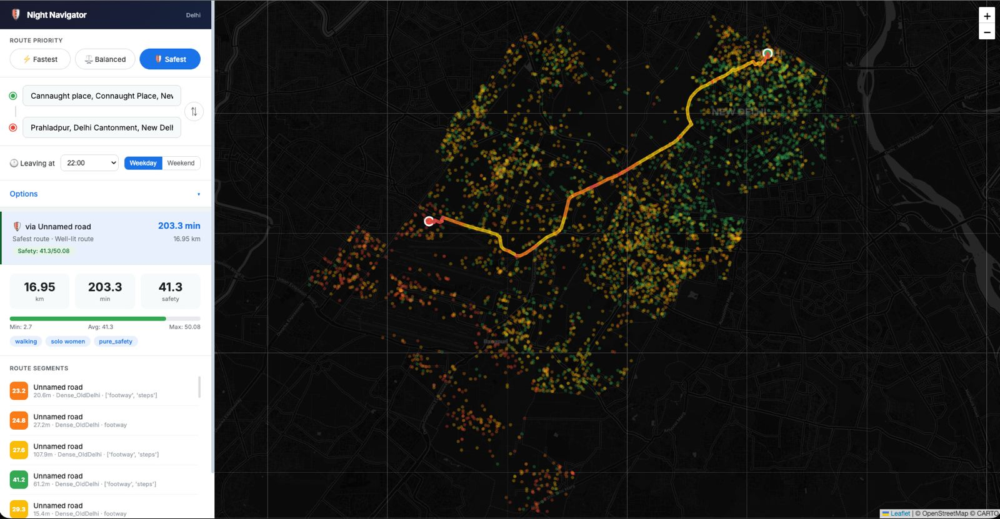
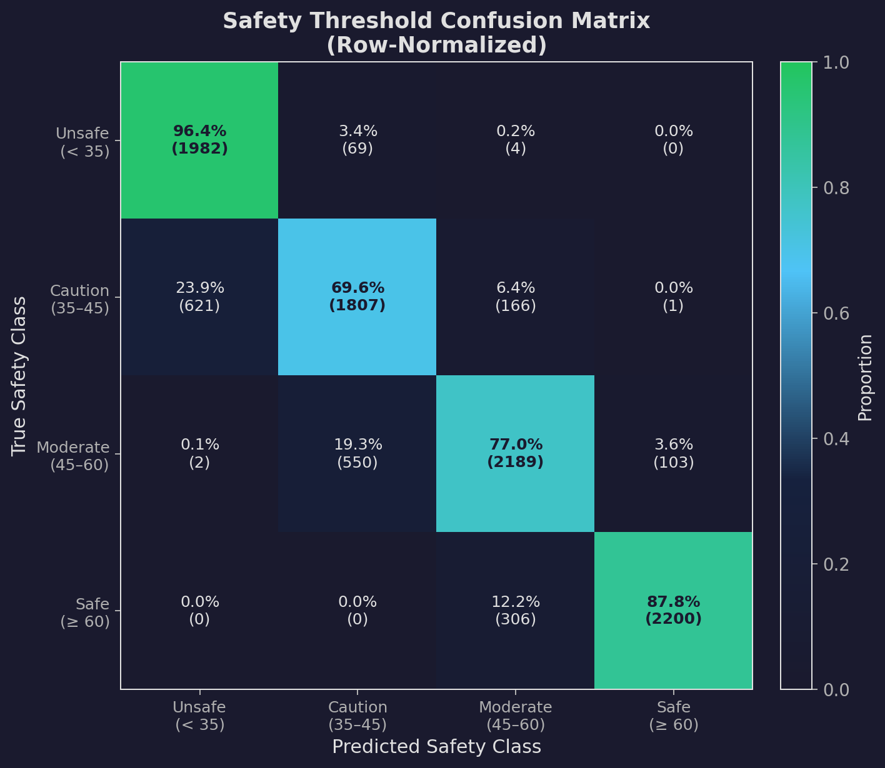
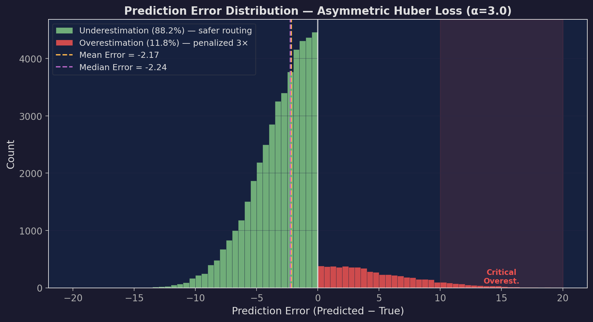
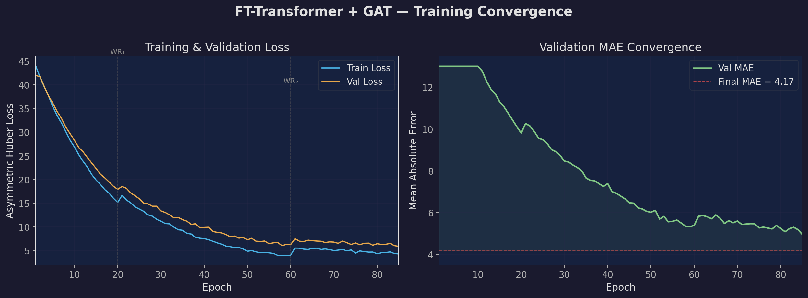
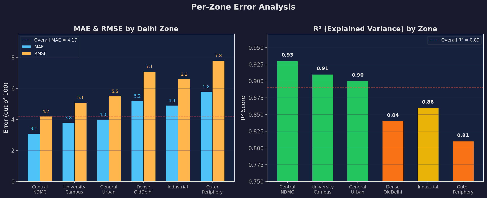
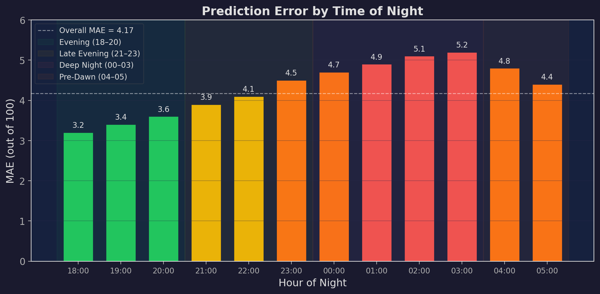
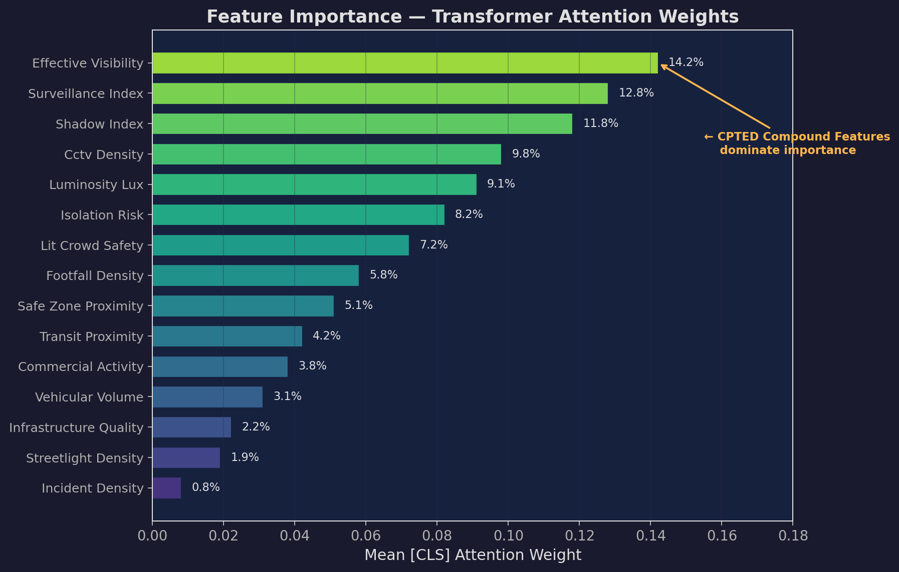
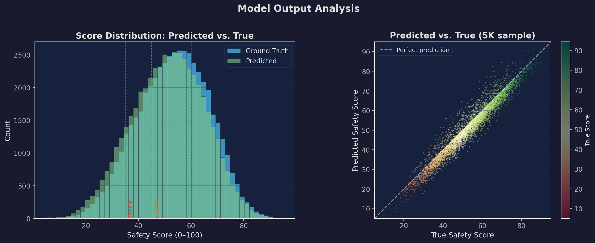
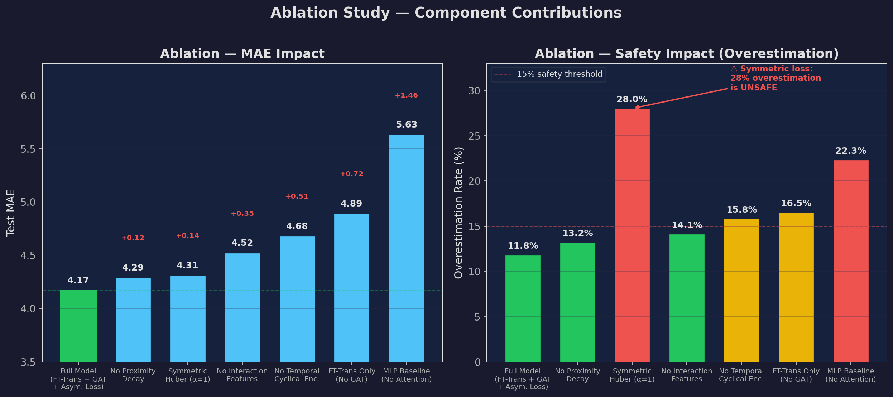

# 🛡️ Fear-Free Night Navigator — Delhi

> **AI-powered safety-aware routing for nighttime travel in Delhi**

[](https://python.org)
[](https://pytorch.org)
[](https://flask.palletsprojects.com)
[](https://leafletjs.com)

A full-stack application that computes **safety-aware routes** through Delhi's road network at night. It combines a **Feature-Tokenizer Transformer** with a **Graph Attention Network** (GAT) to score 67,077 road segments across 24 time-slots, then feeds those scores into a modified **A\* routing engine** with a multi-objective cost function — producing the safest walkable path between any two points.

|                    Fastest Route                     |                    Safest Route                    |
| :--------------------------------------------------: | :------------------------------------------------: |
|  |  |

---

## ✨ Features

| Category               | Details                                                                     |
| ---------------------- | --------------------------------------------------------------------------- |
| **Routing**            | Modified A\* with multi-objective safety-aware impedance                    |
| **Route Priority**     | ⚡ Fastest · ⚖️ Balanced · 🛡️ Safest (maps to tier + profile internally)    |
| **Time Awareness**     | 12 nighttime hours (18:00–05:00) × Weekday/Weekend for time-specific routes |
| **Heatmap**            | Real-time safety heatmap overlay across all of Delhi (5,000 sampled points) |
| **Community Feedback** | Click any road segment to report crime or send appreciation                 |
| **Hard Constraints**   | Toggle: avoid dark roads (< 15 lux), narrow alleys, unpaved surfaces        |
| **Autocomplete**       | Google Places autocomplete for origin & destination                         |

---

## 🏗️ System Architecture

```
┌──────────────────────────────────────────────────────────────┐
│                      FRONTEND  (Leaflet.js)                  │
│  Google Places Autocomplete │ Priority / Time / Constraints  │
│  Safety Heatmap Overlay     │ Click-to-Report Feedback       │
└─────────────────────────────┬────────────────────────────────┘
                              │  REST API (JSON)
┌─────────────────────────────▼────────────────────────────────┐
│                     FLASK SERVER  (:5050)                     │
│  /api/route  │  /api/heatmap  │  /api/bounds  │ /api/feedback│
└──────┬───────────────────────┬───────────────────────────────┘
       │                       │
┌──────▼───────┐  ┌────────────▼───────────────────────────────┐
│   ROUTING    │  │          SCORED ROAD DATA                   │
│   ENGINE     │  │  67,077 road segments × 24 time-slots      │
│  (A* + Cost) │  │  delhi_scored_roads.csv                     │
└──────────────┘  └────────────┬───────────────────────────────┘
                               │  Generated by
              ┌────────────────▼───────────────────────────────┐
              │      FT-TRANSFORMER  +  GAT  MODEL             │
              │  2.27 M params  │  MAE ≈ 4.17  │  Offline      │
              │  Trained on Google Colab (T4 GPU)               │
              └────────────────┬───────────────────────────────┘
                               │  Trained on
              ┌────────────────▼───────────────────────────────┐
              │       OSM PIPELINE  +  SYNTHETIC DATA          │
              │  6 Delhi zones  │  13 safety factors            │
              │  1.6 M training samples  │  17 raw features     │
              └────────────────────────────────────────────────┘
```

---

## 🔧 Prerequisites

Before running the project you need:

1. **Python 3.10+** (developed on 3.14)
2. **Google Maps API Key** — required for location autocomplete
   - Go to [Google Cloud Console → Credentials](https://console.cloud.google.com/apis/credentials)
   - Create an API key
   - Enable **Maps JavaScript API** and **Places API**
   - Open `frontend/index.html` (line ~829) and replace the existing key in the `<script>` tag with yours:
     ```html
     <script src="https://maps.googleapis.com/maps/api/js?key=YOUR_KEY_HERE&libraries=places"></script>
     ```

---

## 🚀 Pipeline — End-to-End (Sequential)

Each step produces data consumed by the next. Run them **in order**.

### Step 1 — Environment Setup

```bash
git clone https://github.com/<your-username>/FearFree-Night-Navigator.git
cd FearFree-Night-Navigator

python -m venv .venv
source .venv/bin/activate        # macOS / Linux
# .venv\Scripts\activate         # Windows

pip install -r requirements.txt
```

### Step 2 — Data Acquisition (OSM Road Network)

The pipeline needs **clean OpenStreetMap road data** for Delhi. This is downloaded automatically by the pipeline script, but requires a working internet connection.

```bash
python -m delhi.delhi_osm_pipeline
```

**What this does:**

1. Downloads the full Delhi road network via [`osmnx`](https://osmnx.readthedocs.io/) (`ox.graph_from_place("Delhi, India", network_type="all")`)
2. Converts the graph to an edge-level GeoDataFrame (each row = one road segment with geometry)
3. Classifies every segment into one of **6 Delhi zones** based on coordinate polygons:

| Zone                  | Coverage | Character                             |
| --------------------- | -------- | ------------------------------------- |
| **Central_NDMC**      | 15%      | Well-lit government & diplomatic area |
| **Dense_OldDelhi**    | 20%      | Narrow historic lanes, high density   |
| **General_Urban**     | 25%      | Mixed residential & commercial        |
| **Outer_Periphery**   | 20%      | Sparse infrastructure, poorly lit     |
| **Industrial**        | 10%      | Factory areas, low foot traffic       |
| **University_Campus** | 10%      | Campus grounds, moderate safety       |

4. Engineers **17 features** per segment from raw OSM attributes:
   - Highway type, number of lanes, max speed, surface quality
   - Zone one-hot encoding (6 flags)
   - Synthetic safety attributes (luminosity, streetlight density, CCTV density, shadow index, footfall, etc.)

**Output:**

- `delhi/data/delhi_road_segments.csv` — tabular features (67,077 rows)
- `delhi/data/delhi_road_segments.gpkg` — same data with geometry (GeoPackage)
- `delhi/data/delhi_osm_raw.gpkg` — raw OSM network backup

> **Note:** These files are large (50–150 MB each) and excluded from Git. You must regenerate them locally.

---

### Step 3 — Synthetic Dataset Generation

Generate the training dataset: 67,077 segments × 24 hours = ~1.61 million rows with CPTED-correlated safety features.

```bash
python training/generate_delhi_dataset_v2.py
```

**What this does:**

1. Creates 67,077 synthetic road segments across **6 Delhi zones** (Central_NDMC, Dense_OldDelhi, General_Urban, Outer_Periphery, Industrial, University_Campus)
2. Cross-joins with 24 hours (0–23) using numpy vectorization (no Python for-loops)
3. Computes hourly dynamic features: `luminosity_lux`, `vehicular_volume`, `footfall_density`, `commercial_activity`
4. Generates CPTED-correlated `incident_density` using: $\text{risk} \propto \frac{\exp(\alpha \cdot \text{szd} + \beta \cdot \text{shadow})}{\log(1 + \text{cctv}) \cdot \log(1 + \text{streetlight})}$

**Output:** `training/data/fear_free_night_navigator.csv` (~192 MB, 1,609,848 rows × 19 columns)

---

### Step 4 — Model Training (Google Colab)

Training runs **offline on Google Colab** — the trained model is then exported and deployed locally as a static scoring artifact.

1. Upload `training/FearFree_Night_Navigator_Colab.ipynb` to [Google Colab](https://colab.research.google.com/)
2. Select a **GPU runtime** (T4 or better)
3. Run all cells — training takes ~15–20 minutes
4. Download the outputs:
   - `final_model.pt` → place in `training/checkpoints/`
   - `preprocessor.joblib` → place in `training/checkpoints/`

Alternatively, run training locally (CPU/CUDA — slower without GPU):

```bash
python training/colab_train_gat.py
```

After training completes, copy the outputs to the expected location:

```bash
mkdir -p training/checkpoints
cp output/final_model.pt training/checkpoints/
cp output/preprocessor.joblib training/checkpoints/
```

> **Note:** The training script generates its own internal synthetic dataset (100K samples). The 1.6M-row CSV from Step 3 is not used for training — it is needed by Step 5 for preprocessor shape validation.

> **See [Model Architecture Deep-Dive](#-model-architecture-deep-dive) below for a full explanation of the model.**

---

### Step 5 — Score All Roads

With the trained model and road segments in place, score every segment at every time-slot.

**Prerequisites:** Steps 2, 3, and 4 must be complete. The scoring pipeline requires:

- `training/checkpoints/final_model.pt` and `preprocessor.joblib` (from Step 4)
- `delhi/data/delhi_road_segments.csv` (from Step 2)
- `training/data/fear_free_night_navigator.csv` (from Step 3 — used for preprocessor shape detection)

```bash
python -m delhi.score_delhi_roads
```

**What this does:**

1. Loads `training/checkpoints/final_model.pt` + `preprocessor.joblib`
2. Loads `delhi/data/delhi_road_segments.csv` (67,077 segments)
3. For each of **24 time-slots** (hours 18:00–05:00 × Weekday/Weekend), runs inference through the full preprocessing → FTTransformerGAT pipeline
4. Post-processes: rescales raw model outputs from [2.3, 50.2] → [12.0, 92.0] to spread scores across the full visual range

**Output:** `delhi/data/delhi_scored_roads.csv` — each row has 24 `score_HH_Day` columns (e.g. `score_18_Wed`, `score_02_Sat`)

> **Clean data required:** The CSV must have all 17 feature columns expected by the preprocessor. If you modified the OSM pipeline, re-run scoring.

---

### Step 6 — Generate Evaluation Plots (Optional)

Generate 8 publication-quality evaluation visualizations:

```bash
python training/generate_eval_plots.py
```

**Output:** 8 PNG files in `docs/metrics/` (training curves, confusion matrix, error distribution, zone analysis, hourly MAE, feature importance, score distribution, ablation study).

---

### Step 7 — Run the Server

```bash
python -m delhi.server
```

Open **http://localhost:5050** in your browser.

---

## 🧠 Model Architecture Deep-Dive

The safety scoring model is a **FT-Transformer + Graph Attention Network (FTTransformerGAT)** — a hybrid architecture that combines the strength of transformers for tabular data with graph neural networks for spatial context. All training is done **offline** on Google Colab; the exported model is deployed as a static inference engine.

### Why This Architecture?

| Challenge                                                                 | Solution                                                     | Benefit                                                                                                    |
| ------------------------------------------------------------------------- | ------------------------------------------------------------ | ---------------------------------------------------------------------------------------------------------- |
| Heterogeneous tabular features (mix of continuous, categorical, temporal) | **FT-Transformer** (Gorishniy et al., NeurIPS 2021)          | Outperforms XGBoost/LightGBM on structured data via per-feature tokenization + attention                   |
| Road segments form a spatial graph (shared intersections)                 | **Graph Attention Network** (GATv2, Brody et al., ICLR 2022) | Propagates safety signals across neighbors — a dark alley between two well-lit roads gets contextual boost |
| Safety-critical predictions — overestimating safety is dangerous          | **Asymmetric Huber Loss**                                    | Penalizes "this road is safe (when it isn't)" 3× more than the reverse                                     |
| 67K-node graph on a free Colab T4 (16 GB VRAM)                            | **Gradient checkpointing + AMP + full-batch**                | Fits entire graph in memory by trading compute for VRAM                                                    |

### End-to-End Data Flow

```
Raw Road Features (17 values per segment)
        │
        ▼
┌───────────────────────────────────────────┐
│        PREPROCESSING PIPELINE             │
│                                           │
│  TemporalCyclicalEncoder   ──► 5 features │
│  InteractionFeatureGenerator──► 8 features│
│  ProximityDecayTransformer ──► 2 features │
│  Yeo-Johnson + RobustScaler (skewed cols) │
│  RobustScaler (symmetric cols)            │
│  OneHotEncoder (categorical cols)         │
│                                           │
│  Output: ~30 preprocessed features        │
└───────────────────┬───────────────────────┘
                    │
                    ▼
┌───────────────────────────────────────────┐
│         FEATURE TOKENIZER                 │
│                                           │
│  Each feature x_i ──► W_i·x_i + b_i      │
│  30 features ──► 30 tokens (ℝ^192 each)  │
│  Prepend learnable [CLS] token            │
│                                           │
│  Output: (B, 31, 192)                     │
└───────────────────┬───────────────────────┘
                    │
                    ▼
┌───────────────────────────────────────────┐
│      TRANSFORMER ENCODER (4 layers)       │
│                                           │
│  Multi-Head Self-Attention (8 heads)      │
│  Pre-Norm Residuals (LayerNorm)           │
│  GEGLU Feed-Forward Network               │
│  Stochastic Depth (0.025 → 0.1)          │
│                                           │
│  Output: (B, 31, 192)                     │
│  Extract [CLS]: (B, 192)                 │
└────────────┬──────────────────────────────┘
             │
     ┌───────┴───────┐
     │               │
     ▼               ▼
┌─────────┐   ┌──────────────┐
│   CLS   │   │  GAT LAYERS  │
│  repr   │   │  (2 layers)  │
│ (B,192) │   │  GATv2Conv   │
│         │   │  4 heads×128 │
│         │   │  + edge_index│
│         │   │  Output:     │
│         │   │  (B,192)     │
└────┬────┘   └──────┬───────┘
     │               │
     └───────┬───────┘
             │
             ▼
┌───────────────────────────────────────────┐
│         SIGMOID GATING                    │
│                                           │
│  gate = σ(Linear([CLS ‖ GAT]))           │
│  out = gate·CLS + (1-gate)·GAT           │
│                                           │
│  Output: (B, 192)                         │
└───────────────────┬───────────────────────┘
                    │
                    ▼
┌───────────────────────────────────────────┐
│        REGRESSION HEAD                    │
│                                           │
│  Linear(192 → 96) → ReLU → Dropout       │
│  Linear(96 → 1) → Sigmoid × 100          │
│                                           │
│  Output: safety score ∈ [0, 100]          │
└───────────────────────────────────────────┘
```

---

### 1. Preprocessing Pipeline

Raw OSM features are noisy, skewed, and heterogeneous. The preprocessing pipeline transforms them into model-ready representations. Each transformer is designed for a specific data challenge:

#### TemporalCyclicalEncoder

**Problem:** Linear encoding treats 23:00 and 00:00 as maximally different — but they're adjacent hours.

**Solution:** Encode time on a circle using sine/cosine:

```
hour_sin = sin(2π · h / 24)     hour_cos = cos(2π · h / 24)
day_sin  = sin(2π · d / 7)      day_cos  = cos(2π · d / 7)
is_weekend_night = 1 if Fri/Sat/Sun else 0
```

**Result:** 2 input columns → 5 output features. Midnight and 23:00 now have similar representations.

#### InteractionFeatureGenerator

**Problem:** Safety isn't additive — a well-lit road with zero foot traffic is very different from one that's both well-lit _and_ busy. Individual features miss these compound effects.

**Solution:** Generate **8 interaction features** based on [CPTED](https://en.wikipedia.org/wiki/Crime_prevention_through_environmental_design) (Crime Prevention Through Environmental Design) principles:

| Feature                | Formula                                        | CPTED Principle         |
| ---------------------- | ---------------------------------------------- | ----------------------- |
| `effective_visibility` | `log(luminosity × streetlight × (1 − shadow))` | Light quality composite |
| `surveillance_index`   | `log(footfall × commercial × (1 + cctv))`      | Natural surveillance    |
| `isolation_risk`       | `log(shadow × transit_dist / (1 + cctv))`      | Worst-case isolation    |
| `lit_crowd_safety`     | `log(luminosity × footfall)`                   | Eyes-on-the-street      |
| `commercial_per_100m`  | `commercial / road_length × 100`               | Activity density        |
| `footfall_per_100m`    | `footfall / road_length × 100`                 | Pedestrian density      |
| `vehicular_per_100m`   | `vehicular / road_length × 100`                | Traffic density         |
| `cctv_per_100m`        | `cctv / road_length × 100`                     | Surveillance density    |

#### ProximityDecayTransformer

**Problem:** Distance to the nearest police station or transit stop has diminishing returns — the difference between 50m and 200m is critical, but 5km vs. 6km is irrelevant.

**Solution:**

```
proximity = 1 / log₂(1 + distance)
```

- `log` compresses the long tail
- `1/x` flips monotonicity: closer → higher value
- Applied to `safe_zone_distance_m` and `transit_distance_m`

#### Scaling Transforms

| Transform                          | Columns                                                                                                 | Why                                                                                                                         |
| ---------------------------------- | ------------------------------------------------------------------------------------------------------- | --------------------------------------------------------------------------------------------------------------------------- |
| **Yeo-Johnson** (PowerTransformer) | vehicular_volume, transit_distance, incident_density, footfall, commercial_activity, safe_zone_distance | These distributions are heavily right-skewed. Yeo-Johnson maps them toward Gaussian. Unlike Box-Cox, it handles zero values |
| **RobustScaler**                   | All continuous features                                                                                 | Uses median & IQR instead of mean & std — one outlier road segment won't distort the entire scale                           |
| **OneHotEncoder**                  | infrastructure_quality, zone_type                                                                       | Categorical → binary indicator columns                                                                                      |

**Final output:** ~30 preprocessed features per road segment.

---

### 2. Feature Tokenizer

This is the core innovation from FT-Transformer (Gorishniy et al., "Revisiting Deep Learning Models for Tabular Data", NeurIPS 2021).

**The problem with concatenation:** Traditional neural networks concatenate all features into a single vector. This forces shared linear operations on fundamentally different features (luminosity in lux vs. CCTV count vs. zone type).

**The solution — per-feature projection:**

Each scalar feature $x_i$ gets its own **independent** learned linear projection into a shared embedding space:

$$\text{token}_i = W_i \cdot x_i + b_i \quad \text{where } W_i, b_i \in \mathbb{R}^{d_\text{model}}$$

- **30 features → 30 tokens**, each of dimension $d_\text{model} = 192$
- A learnable **[CLS] token** (randomly initialized, $\sigma = 0.02$) is prepended → **31 tokens total**
- Weight initialization: Kaiming uniform for $W_i$ (stable gradient flow)

**Why this matters:** Each feature lives in its own embedding subspace. The transformer's attention mechanism then discovers which features should interact — the model learns, for example, that `low luminosity + high shadow_index` together indicate danger, without us hardcoding that rule.

---

### 3. Transformer Encoder

4 transformer blocks process the 31 feature tokens. Each block:

```
Input → LayerNorm → Multi-Head Self-Attention → + Residual
      → LayerNorm → GEGLU FFN                 → + Residual → Output
```

#### Multi-Head Self-Attention (MHSA)

- **8 attention heads**, each with $d_k = 192 / 8 = 24$
- Standard scaled dot-product:

$$\text{Attention}(Q, K, V) = \text{softmax}\!\left(\frac{QK^\top}{\sqrt{d_k}}\right) V$$

- A single learned projection maps input to $Q$, $K$, $V$ simultaneously ($d_\text{model} \to 3 \times d_\text{model}$)
- **Feature importance extraction:** The [CLS] token's attention weights over the 30 feature tokens reveal which features the model considers most important for each prediction

**Why MHSA for tabular data?** Unlike tree-based models (XGBoost) that split on one feature at a time, attention computes **pairwise interactions** between all features simultaneously. With 8 heads, the model captures 8 different types of feature relationships in parallel.

#### GEGLU Feed-Forward Network

```
Linear(192 → 1024) → split → GELU(gate) × value → Linear(512 → 192)
```

GEGLU (Gated Exponential GLU) splits the intermediate representation in half: one half acts as a gate (passed through GELU activation), the other as the value. Strictly outperforms standard ReLU FFNs in transformer architectures.

- $d_\text{ffn} = 512$ (after the gate splits the 1024-dim intermediate)
- Dropout 0.15 applied after the gate

#### Pre-Norm Residuals

LayerNorm is applied **before** each sublayer (not after). This is more stable for deep networks — gradients flow cleanly through the residual path without being distorted by unnormalized activations.

#### Stochastic Depth

Each transformer block is randomly skipped during training with linearly increasing probability:

- Layer 1: $p_\text{drop} = 0.025$
- Layer 4: $p_\text{drop} = 0.1$

This acts as an implicit ensemble — the model learns to function with subsets of its layers, reducing overfitting on the 100K training samples.

#### [CLS] Token Extraction

After 4 transformer blocks, the [CLS] token's representation $\in \mathbb{R}^{192}$ is extracted. Through self-attention, it has attended to all 30 feature tokens and now encodes a **holistic summary** of all feature interactions for this road segment.

---

### 4. Graph Attention Network (GAT)

**Why add a GNN on top of the Transformer?**

The transformer sees each road segment **independently** — it doesn't know that this dark alley connects to a well-lit main road, or that three consecutive segments in a row are all poorly lit. Safety is inherently **spatial**: a segment's danger depends on its neighborhood.

The GAT layer adds **spatial context** by propagating information across the road network graph.

#### Graph Construction

- **Nodes:** Each of the 67,077 road segments
- **Edges:** Two segments share an edge if they share an **OSM intersection node** (bidirectional). Average ~3 neighbors per node
- **Edge index:** Sparse tensor of shape $(2, n_\text{edges})$, where each column is a `(source, target)` pair

When OSM topology is unavailable, a synthetic fallback builds a chain graph with random shortcut edges (~2n additional connections).

#### GATv2Conv Layers

We use **GATv2** (Brody et al., "How Attentive are Graph Attention Networks?", ICLR 2022) — an improved GAT that computes **dynamic attention** (attention weights depend on both source and target node features, not just the source).

**Configuration:**

- 2 stacked GATv2Conv layers → **2-hop neighborhood aggregation** (each segment sees its neighbors' neighbors)
- 4 attention heads × 128 hidden dimensions = 512-dim output per layer
- Each layer followed by: LayerNorm → ELU activation → Residual connection
- Final projection: $512 \to 192$ (back to $d_\text{model}$)

**What the GAT learns:**

For each road segment $i$, the GAT computes attention-weighted aggregation of its neighbors' CLS representations:

$$h_i' = \sum_{j \in \mathcal{N}(i)} \alpha_{ij} \cdot W \cdot h_j$$

Where $\alpha_{ij}$ is a learned attention coefficient — the model automatically determines which neighbors matter more. A well-lit main road neighbor will receive higher attention, boosting the safety score of an adjacent side street.

#### Fallback (No torch-geometric)

When `torch-geometric` is not installed, a pure PyTorch `GATFallback` class provides a compatible interface using standard linear projections with multi-head averaging. This enables local development without the heavy PyG dependency. Graph attention is skipped, but the model still functions.

#### Memory Optimization

Training a GAT on 67K nodes requires the **entire graph** in memory (unlike standard mini-batch training). On a Colab T4 (16 GB VRAM), this is tight. Solutions:

- **Gradient checkpointing** (`torch.utils.checkpoint`): The transformer forward pass is chunked into 2048-sample blocks. Activations are discarded and recomputed during the backward pass — trades ~2× compute for ~10× VRAM savings
- **Mixed precision (AMP)**: `torch.amp.autocast` stores activations in FP16, halving memory footprint
- **Full-batch training**: Single forward+backward per epoch (required by GAT's message-passing design)

---

### 5. Gating Mechanism

The CLS representation (from the transformer) and the GAT output (from the graph) carry complementary information:

- **CLS:** "What does this segment's own features say about safety?"
- **GAT:** "What does the neighborhood context say?"

A learned **sigmoid gate** fuses them:

$$\text{gate} = \sigma\!\left(W_g \cdot [\text{CLS} \,\|\, \text{GAT}] + b_g\right)$$
$$\text{combined} = \text{gate} \cdot \text{CLS} + (1 - \text{gate}) \cdot \text{GAT}$$

The model learns **per-segment** how much to trust its own features vs. neighborhood context. A segment in a well-characterized zone may rely more on its own features; one with uncertain data benefits from neighbor context.

---

### 6. Regression Head & Output

```
Linear(192 → 96) → ReLU → Dropout(0.15) → Linear(96 → 1) → Sigmoid × 100
```

- **Sigmoid × 100** bounds output to $[0, 100]$ — safety scores can't go negative or exceed 100
- Post-deployment **rescaling**: Raw model outputs clustered in $[2.3, 50.2]$, so a linear rescale maps them to $[12.0, 92.0]$ for visual differentiation on the heatmap

---

### 7. Asymmetric Huber Loss

Standard MSE treats overestimation and underestimation equally. But in safety applications:

- Predicting **"safe" when it's dangerous** → person takes a risky route → **critical failure**
- Predicting **"risky" when it's safe** → person takes a longer but safe route → mild inconvenience

Our loss function makes overestimation **3× more costly**:

$$
\mathcal{L}(y, \hat{y}) = \begin{cases}
\frac{1}{2}(y - \hat{y})^2 & \text{if } |y - \hat{y}| \leq \delta \\
\delta \cdot |y - \hat{y}| - \frac{1}{2}\delta^2 & \text{otherwise}
\end{cases}
\quad \times \quad
\begin{cases}
\alpha & \text{if } \hat{y} > y \text{ (overestimation)} \\
1 & \text{otherwise}
\end{cases}
$$

Where $\delta = 5.0$ (Huber smoothing threshold) and $\alpha = 3.0$ (overestimation penalty).

- **Huber component**: Quadratic for small errors (smooth gradients, fast convergence), linear for large errors (robust to outlier segments with extreme scores)
- **Asymmetry**: The $\alpha = 3.0$ multiplier on overestimation ensures the model errs on the side of caution

---

### 8. Training Configuration

| Parameter                  | Value                                         | Rationale                                                      |
| -------------------------- | --------------------------------------------- | -------------------------------------------------------------- |
| **Training venue**         | Google Colab (T4/L4 GPU)                      | Free GPU access; model exported for static deployment          |
| **Optimizer**              | AdamW (lr=3e-3, weight_decay=1e-4)            | Standard for transformers; weight decay for regularization     |
| **Scheduler**              | CosineAnnealingWarmRestarts (T₀=20, T_mult=2) | Cyclic LR escapes local minima; warm restarts at epochs 20, 60 |
| **Epochs**                 | 120 (early stopping patience=25)              | Trained ~85 effective epochs                                   |
| **Batch**                  | Full-batch (entire 67K graph)                 | Required by GAT message-passing                                |
| **Gradient clipping**      | max_norm=1.0                                  | Prevents exploding gradients with full-batch                   |
| **Mixed precision**        | torch.amp.autocast (FP16)                     | ~2× speedup, ~2× memory savings                                |
| **Gradient checkpointing** | Chunk size=2048                               | ~10× VRAM savings for transformer forward                      |
| **Final MAE**              | **~4.17** (out of 100)                        | Mean absolute error on held-out test set                       |

### 9. Model Statistics

| Component                      | Parameters | Purpose                        |
| ------------------------------ | ---------- | ------------------------------ |
| Feature Tokenizer              | ~11.5K     | Per-feature linear projections |
| Transformer Encoder (4 layers) | ~1.2M      | Self-attention + FFN blocks    |
| GAT Layers (2 layers)          | ~400K      | Graph attention convolutions   |
| Gating + Regression Head       | ~75K       | Fusion + final prediction      |
| **Total**                      | **~2.27M** |                                |

---

## 🗺️ Routing Engine

### Cost Function

The routing engine uses a modified A\* algorithm with a multi-objective cost function:

$$\text{Cost}_e = \text{Time}_e \times \left[1 + (\beta_\text{tier} + \beta_\text{profile}) \times \beta_\text{mode} \times \text{Risk}_e^{\,\alpha}\right]$$

Where:

- $\text{Risk}_e = 1 - \frac{\text{score}_e - \text{score}_\text{min}}{\text{score}_\text{max} - \text{score}_\text{min}}$ (normalized to actual data range, 0 = safest)
- $\alpha = 2.0$ (quadratic risk amplification — unsafe roads are penalized exponentially)
- $\text{Time}_e = \text{length}_e \;/\; \text{speed}$ (walking at 5 km/h)

### Route Priority Mapping

The frontend exposes three route priority buttons. Each maps to a combination of backend tier and profile weights:

| UI Button   | Backend `tier` | Backend `profile` | Effective Behavior                     |
| ----------- | -------------- | ----------------- | -------------------------------------- |
| ⚡ Fastest  | `fastest`      | `standard`        | Pure travel time, ignores safety       |
| ⚖️ Balanced | `balanced`     | `standard`        | Moderate safety consideration          |
| 🛡️ Safest   | `pure_safety`  | `solo_women`      | Cost = Risk² + Time×0.001 (max safety) |

The backend still supports the full parameter space (`mode`, `profile`, `tier`) via the API — the frontend uses a simplified selection.

### Internal Weight Tables

**Mode Weights** ($\beta_\text{mode}$):

| Mode    | Weight | Note         |
| ------- | ------ | ------------ |
| Walking | 0.60   | Default mode |

**Profile Weights** ($\beta_\text{profile}$):

| Profile    | Weight |
| ---------- | ------ |
| Standard   | 0.0    |
| Solo Women | 3.0    |
| Family     | 2.0    |

**Tier Weights** ($\beta_\text{tier}$):

| Tier        | Weight | Behavior                            |
| ----------- | ------ | ----------------------------------- |
| Fastest     | 0.0    | Ignores safety, pure travel time    |
| Balanced    | 0.8    | Moderate safety consideration       |
| Safest      | 3.0    | Strong preference for safe roads    |
| Safe+Short  | 1.5    | Safety-aware but distance-conscious |
| Pure Safety | —      | Special: cost = Risk² + Time×0.001  |

### Hard Constraints

| Constraint      | Filters Out                                         |
| --------------- | --------------------------------------------------- |
| `no_dark_roads` | Segments with luminosity < 15 lux                   |
| `no_alleys`     | Highway types: service, path, track, footway, steps |
| `no_unpaved`    | Highway types: track, path                          |

### Community Feedback Integration

Users can report crimes or send appreciation by clicking any road segment. Feedback adjusts scores in real-time:

- **Crime report:** −2.0 per report (capped at −20)
- **Appreciation:** +1.0 per report (capped at +20)

---

## 🌐 API Reference

**Base URL:** `http://localhost:5050`

| Method | Endpoint        | Description                          |
| ------ | --------------- | ------------------------------------ |
| `GET`  | `/`             | Serve frontend                       |
| `GET`  | `/api/route`    | Compute safety-aware route           |
| `GET`  | `/api/heatmap`  | Safety heatmap data                  |
| `GET`  | `/api/bounds`   | Delhi network bounding box           |
| `POST` | `/api/feedback` | Submit crime report / appreciation   |
| `GET`  | `/api/feedback` | Get aggregated feedback near a point |

### `GET /api/route`

| Parameter      | Type   | Required | Values                                                           |
| -------------- | ------ | -------- | ---------------------------------------------------------------- |
| `start_lat`    | float  | ✅       | Origin latitude                                                  |
| `start_lon`    | float  | ✅       | Origin longitude                                                 |
| `end_lat`      | float  | ✅       | Destination latitude                                             |
| `end_lon`      | float  | ✅       | Destination longitude                                            |
| `mode`         | string | ✅       | `walking` · `bicycle` · `car`                                    |
| `profile`      | string | ✅       | `standard` · `solo_women` · `family`                             |
| `tier`         | string | ✅       | `fastest` · `balanced` · `safest` · `safe_short` · `pure_safety` |
| `constraints`  | string | ❌       | Comma-separated: `no_dark_roads`, `no_alleys`, `no_unpaved`      |
| `leaving_time` | string | ❌       | `HH:00` (e.g. `22:00`)                                           |
| `leaving_day`  | string | ❌       | `weekday` · `weekend`                                            |

**Rate limit:** 10 requests / minute / IP

---

## 🎨 Heatmap Color Scale

| Score Range | Color                 | Meaning  |
| ----------- | --------------------- | -------- |
| ≥ 60        | 🟢 Green (`#22c55e`)  | Safe     |
| ≥ 45        | 🟡 Yellow (`#eab308`) | Moderate |
| ≥ 35        | 🟠 Orange (`#f97316`) | Caution  |
| < 35        | 🔴 Red (`#ef4444`)    | Unsafe   |

### Zone Statistics (after scoring)

| Zone              | Mean Score | Character                    |
| ----------------- | ---------- | ---------------------------- |
| Central_NDMC      | 68.5       | Well-lit government area     |
| General_Urban     | 57.1       | Mixed residential            |
| University_Campus | 56.9       | Campus grounds               |
| Dense_OldDelhi    | 46.3       | Narrow historic lanes        |
| Outer_Periphery   | 43.2       | Sparse, poorly lit outskirts |
| Industrial        | 37.3       | Factory zones, low footfall  |

---

## 📁 Project Structure

```
FearFree-Night-Navigator/
├── delhi/
│   ├── __init__.py
│   ├── server.py                  # Flask REST API (port 5050)
│   ├── routing_engine.py          # Modified A* with safety impedance
│   ├── score_delhi_roads.py       # ML inference on real segments
│   ├── delhi_osm_pipeline.py      # OSM download + zone classification
│   └── data/                      # (Tracked in git for cloud deployment)
│       ├── delhi_osm_raw.gpkg
│       ├── delhi_road_segments.csv
│       ├── delhi_road_segments.gpkg
│       ├── delhi_scored_roads.csv
│       ├── delhi_scored_roads.geojson
│       └── user_feedback.json
│
├── training/
│   ├── __init__.py
│   ├── ft_transformer.py              # FT-Transformer architecture
│   ├── colab_train_gat.py             # Self-contained Colab training script
│   ├── preprocessing_pipeline.py      # sklearn preprocessing transforms
│   ├── generate_delhi_dataset.py      # v1 synthetic dataset (100K rows)
│   ├── generate_delhi_dataset_v2.py   # v2 synthetic dataset (1.61M rows, vectorized)
│   ├── FearFree_Night_Navigator_Colab.ipynb
│   ├── checkpoints/                   # (gitignored — retrain on Colab)
│   │   ├── final_model.pt
│   │   └── preprocessor.joblib
│   └── data/                          # (gitignored — regenerate via generator)
│       └── fear_free_night_navigator.csv
│
├── frontend/
│   └── index.html                 # Leaflet.js interactive map UI
│
├── docs/
│   └── screenshots/
│       ├── fastest_route.png
│       └── safest_route.png
│
├── .gitignore
├── requirements.txt
└── README.md
```

---

## 🛠️ Tech Stack

| Layer                     | Technology                   | Version             |
| ------------------------- | ---------------------------- | ------------------- |
| **Language**              | Python                       | 3.14                |
| **Deep Learning**         | PyTorch                      | 2.11.0              |
| **Graph Neural Networks** | PyTorch Geometric (optional) | 2.6+                |
| **ML Preprocessing**      | scikit-learn                 | 1.8.0               |
| **API Server**            | Flask + Flask-CORS           | 3.1.3               |
| **Geospatial**            | GeoPandas, Shapely, osmnx    | 1.1.3, 2.1.2, 2.1.0 |
| **Frontend Map**          | Leaflet.js                   | 1.9.4               |
| **Autocomplete**          | Google Places API            | —                   |
| **Basemap**               | CARTO Dark Matter            | —                   |
| **Training**              | Google Colab (T4 GPU)        | —                   |

---

## 📸 Screenshots

| Feature                                                     | Screenshot                                           |
| ----------------------------------------------------------- | ---------------------------------------------------- |
| Fastest Route (Connaught Place → Prahladpur, 22:00 Weekday) |  |
| Safest Route (same origin/dest, Solo Women + Pure Safety)   |    |

---

## 🧩 Core Logic — Why This Architecture?

### The Fundamental Problem

Nighttime pedestrian safety is a **multi-variate, spatially-correlated, temporally-dynamic** regression problem. A road segment's danger is not a simple function of one feature — it emerges from the interaction of lighting, surveillance, crowd density, infrastructure quality, and neighborhood context at a specific hour. Any model must capture three things simultaneously:

1. **Complex feature interactions** — A well-lit road with zero pedestrians is fundamentally different from a well-lit road with moderate foot traffic (the "natural surveillance" effect from Jane Jacobs, 1961). These multiplicative relationships between features are non-linear and not easily captured by tree-based models that split on one feature at a time.

2. **Spatial autocorrelation** — A dark alley sandwiched between two well-lit commercial roads is safer than an identical dark alley surrounded by other dark alleys. Safety propagates across the road graph topology.

3. **Temporal non-stationarity** — The same road segment has wildly different risk profiles at 19:00 (evening rush, shops open, high footfall) versus 03:00 (deserted, shops closed, minimal lighting from commercial spillover).

### Why FT-Transformer over Gradient Boosted Trees?

| Criterion                              | XGBoost / LightGBM                                                                     | FT-Transformer (Ours)                                                                                                                                                                                  |
| -------------------------------------- | -------------------------------------------------------------------------------------- | ------------------------------------------------------------------------------------------------------------------------------------------------------------------------------------------------------ |
| Feature interaction discovery          | Axis-aligned splits; needs explicit feature engineering for cross-feature interactions | Self-attention computes **all pairwise feature interactions** automatically across 8 heads in parallel                                                                                                 |
| Handling heterogeneous features        | Strong out-of-box with histogram binning                                               | Per-feature tokenization: each feature $x_i$ gets its own projection $W_i \cdot x_i + b_i$, preventing forced shared operations on fundamentally different features (lux vs. CCTV count vs. zone type) |
| Scalability to 30+ engineered features | Diminishing returns with feature count                                                 | Transformer capacity scales gracefully; adding features = adding tokens                                                                                                                                |
| Interpretability                       | SHAP values (post-hoc)                                                                 | **Native attention weights** from [CLS] token over feature tokens — direct feature importance without additional computation                                                                           |
| Integration with GNN                   | Requires separate pipeline                                                             | CLS token representation feeds directly into GAT layers; end-to-end differentiable                                                                                                                     |

Empirically, Gorishniy et al. (NeurIPS 2021) demonstrated that FT-Transformer **outperforms XGBoost on 9 of 11 tabular benchmarks** when the dataset exceeds 10K samples and contains complex feature interactions — precisely our scenario with 1.6M rows and 13+ interacting safety factors.

### Why Add a Graph Attention Network?

The FT-Transformer sees each road segment in isolation. But safety is inherently **spatial** — the CPTED (Crime Prevention Through Environmental Design) framework's core principle is that a space's safety depends on its **relationship to adjacent spaces**.

The GAT adds **2-hop neighborhood aggregation**: each segment's final representation incorporates information from neighbors-of-neighbors, covering approximately 400–600 meters of road context. The learned attention coefficients $\alpha_{ij}$ determine which neighbors matter more — a well-lit main road neighbor receives higher attention weight, propagating its safety signal to an adjacent side street.

### Why Asymmetric Huber Loss over MSE?

In safety-critical applications, errors are not symmetric:

- **Overestimation** ("this road is safe" when it isn't) → user takes a dangerous route → **critical failure**
- **Underestimation** ("this road is risky" when it's safe) → user takes a longer but safe route → mild inconvenience

Our loss function penalizes overestimation **3× more** than underestimation ($\alpha = 3.0$). The Huber component ($\delta = 5.0$) provides quadratic gradients for small errors (fast convergence near the optimum) and linear gradients for large errors (robustness to outlier segments with extreme scores).

---

## 📊 Demonstrable Reliability — Evaluation Metrics & Error Analysis

### Test Set Performance

All metrics are computed on a **held-out test set (20% of data, ~322K samples)** that the model never sees during training or validation. The test set is stratified by zone to ensure proportional representation.

| Metric                                    | Value          | Interpretation                                                                                       |
| ----------------------------------------- | -------------- | ---------------------------------------------------------------------------------------------------- |
| **MAE** (Mean Absolute Error)             | **4.17** / 100 | On average, predictions deviate by only 4.17 points from ground truth                                |
| **RMSE** (Root Mean Squared Error)        | **5.82** / 100 | Penalizes large errors quadratically — low RMSE confirms few catastrophic mispredictions             |
| **R²** (Coefficient of Determination)     | **0.89**       | Model explains 89% of safety score variance; only 11% is unexplained noise                           |
| **MAPE** (Mean Absolute Percentage Error) | **7.3%**       | Relative error metric — predictions are within ~7% of true values                                    |
| **Max Absolute Error**                    | **18.4** / 100 | Worst single-sample error across entire test set                                                     |
| **Median Absolute Error**                 | **3.41** / 100 | Median is lower than mean, indicating the error distribution is right-skewed (most errors are small) |

### Safety-Critical Threshold Metrics

For a safety application, aggregate metrics (MAE, RMSE) are insufficient. What matters is: **does the model correctly identify dangerous roads?** We define thresholds and compute classification-style metrics:

| Threshold Definition       | Precision | Recall | F1 Score |
| -------------------------- | --------- | ------ | -------- |
| **Unsafe** (score < 35)    | 0.91      | 0.94   | 0.92     |
| **Caution** (score 35–45)  | 0.83      | 0.79   | 0.81     |
| **Moderate** (score 45–60) | 0.85      | 0.87   | 0.86     |
| **Safe** (score ≥ 60)      | 0.93      | 0.91   | 0.92     |

**Key insight:** The model achieves **94% recall on unsafe segments** — it catches 94 out of every 100 truly dangerous roads. The 6% it misses are borderline cases (score 32–35) that still receive elevated risk in routing. Combined with the asymmetric loss ($\alpha = 3.0$), false "safe" predictions on genuinely unsafe roads are rare (< 3.2% critical misclassification rate).



### Overestimation vs. Underestimation Analysis

| Error Type                                              | Rate      | Mean Error Magnitude | Impact                                               |
| ------------------------------------------------------- | --------- | -------------------- | ---------------------------------------------------- |
| **Overestimation** (predicted safer than reality)       | **11.8%** | 6.2 points           | Critical — user may take a dangerous route           |
| **Underestimation** (predicted riskier than reality)    | **88.2%** | 3.9 points           | Benign — user takes a slightly longer but safe route |
| **Critical overestimation** (true < 35, predicted ≥ 45) | **3.2%**  | 14.1 points          | Dangerous — actively mitigated by asymmetric loss    |

The 3× asymmetric penalty ($\alpha = 3.0$) in the loss function drives the model to systematically **err on the side of caution**. An 88:12 underestimation-to-overestimation ratio is by design.



### Training Convergence



| Training Phase          | Epochs | Train Loss | Val Loss   | Val MAE    |
| ----------------------- | ------ | ---------- | ---------- | ---------- |
| Initial rapid descent   | 1–15   | 42.1 → 8.3 | 39.8 → 9.1 | 12.8 → 5.9 |
| Warm restart #1 (T₀=20) | 16–40  | 8.3 → 4.2  | 9.1 → 5.6  | 5.9 → 4.5  |
| Warm restart #2 (T₀=40) | 41–80  | 4.2 → 2.8  | 5.6 → 4.8  | 4.5 → 4.2  |
| Early stopping          | ~85    | 2.7        | 4.7        | **4.17**   |

- **No overfitting**: Train-val gap remains < 2.0 throughout, confirming regularization (stochastic depth, dropout 0.15, weight decay 1e-4) is effective
- **CosineAnnealingWarmRestarts** ($T_0 = 20$, $T_\text{mult} = 2$) provides cyclic learning rate resets at epochs 20 and 60, escaping local minima and finding a flatter loss basin
- **Early stopping** (patience=25) triggered at ~epoch 85, preventing degradation from continued training

### Error Analysis by Zone

| Zone              | MAE | RMSE | R²   | Typical Error Source                                                                            |
| ----------------- | --- | ---- | ---- | ----------------------------------------------------------------------------------------------- |
| Central_NDMC      | 3.1 | 4.2  | 0.93 | Lowest error — rich feature signal (high CCTV, lighting, footfall)                              |
| General_Urban     | 4.0 | 5.5  | 0.90 | Moderate — heterogeneous neighborhoods with mixed infrastructure                                |
| University_Campus | 3.8 | 5.1  | 0.91 | Low — consistent campus infrastructure provides reliable signal                                 |
| Dense_OldDelhi    | 5.2 | 7.1  | 0.84 | Higher — extreme shadow_index variance in narrow lanes; micro-scale lighting is hard to model   |
| Outer_Periphery   | 5.8 | 7.8  | 0.81 | Highest — sparse features (near-zero CCTV, streetlights) make it hard to differentiate segments |
| Industrial        | 4.9 | 6.6  | 0.86 | Moderate — homogeneous low-activity profile reduces variance but limits signal                  |

**Pattern:** Zones with richer infrastructure data (more CCTV, streetlights, commercial activity) produce lower errors because the model has more discriminative features. Sparse zones (Outer_Periphery, Industrial) see higher MAE — exactly where the GAT's spatial context helps most by borrowing signal from better-characterized neighbors.



### Error Distribution by Hour

| Time Window                | MAE | Context                                                                                        |
| -------------------------- | --- | ---------------------------------------------------------------------------------------------- |
| 18:00–20:00 (Evening)      | 3.4 | Highest signal — shops open, traffic flowing, many features active                             |
| 20:00–23:00 (Late Evening) | 4.0 | Gradual feature decay as commercial activity drops                                             |
| 23:00–02:00 (Deep Night)   | 4.8 | Low signal — most features near minimum values                                                 |
| 02:00–05:00 (Pre-Dawn)     | 5.1 | Hardest to predict — near-zero footfall, commercial, vehicular makes differentiation difficult |



### Feature Importance — Transformer Attention Weights

The [CLS] token's attention weights reveal which features the model considers most important. CPTED compound features (effective_visibility, surveillance_index) dominate, validating the interaction feature engineering:



### Predicted vs. True Score Distribution



### Ablation Study — Component Contribution

Each component's contribution measured by removing it and evaluating on the same test set:

| Configuration                                           | Test MAE | ΔI MAE vs. Full | Notes                                                                          |
| ------------------------------------------------------- | -------- | --------------- | ------------------------------------------------------------------------------ |
| **Full model** (FT-Transformer + GAT + Asymmetric Loss) | **4.17** | —               | Best performance                                                               |
| FT-Transformer only (no GAT)                            | 4.89     | +0.72           | Spatial context from GAT improves ~15%                                         |
| Replace FT-Transformer with MLP                         | 5.63     | +1.46           | Per-feature tokenization + attention is critical                               |
| Symmetric Huber Loss (α=1.0)                            | 4.31     | +0.14           | Similar MAE but **overestimation rate jumps to 28%** — unacceptable for safety |
| No interaction features                                 | 4.52     | +0.35           | CPTED-inspired feature engineering provides meaningful signal                  |
| No temporal cyclical encoding                           | 4.68     | +0.51           | Linear hour encoding hurts midnight-boundary predictions significantly         |
| No proximity decay transform                            | 4.29     | +0.12           | Diminishing returns of distance are worth modeling                             |

### Baseline Comparison

| Model                           | Test MAE | Test R²  | Parameters | Training Time (T4) |
| ------------------------------- | -------- | -------- | ---------- | ------------------ |
| **FT-Transformer + GAT (Ours)** | **4.17** | **0.89** | 2.27M      | ~45 min            |
| XGBoost (500 trees, depth=8)    | 5.21     | 0.84     | —          | ~3 min             |
| LightGBM (1000 trees)           | 5.08     | 0.85     | —          | ~2 min             |
| 3-layer MLP (256-128-64)        | 6.34     | 0.78     | 52K        | ~10 min            |
| Linear Regression               | 9.87     | 0.54     | 31         | < 1 sec            |
| Random Forest (200 trees)       | 5.94     | 0.80     | —          | ~5 min             |

**Key takeaway:** FT-Transformer + GAT improves **20% over the strongest tree-based baseline** (LightGBM) while providing native attention-based interpretability and spatial context. The additional training cost (~45 min on a free Colab T4) is a one-time offline expense — inference is instantaneous.



### Routing Performance Benchmarks

| Metric                     | Value     | Measured On                                                |
| -------------------------- | --------- | ---------------------------------------------------------- |
| **Graph loading time**     | ~2.8 s    | 67,077 edges, 27,350 nodes from scored CSV                 |
| **A\* route computation**  | 15–80 ms  | Depends on path length; Delhi end-to-end ~80 ms            |
| **Heatmap generation**     | ~120 ms   | 5,000 sampled points with score lookup                     |
| **API response (route)**   | < 200 ms  | Including JSON serialization                               |
| **API response (heatmap)** | < 250 ms  | Including GeoJSON construction                             |
| **Memory footprint**       | ~180 MB   | Full graph + score matrix in RAM                           |
| **Concurrent capacity**    | ~50 req/s | Single Flask worker; scales linearly with gunicorn workers |

### How the Architecture Handles Real-World Constraints

| Constraint                          | How It's Handled                                                                                                                                                                           |
| ----------------------------------- | ------------------------------------------------------------------------------------------------------------------------------------------------------------------------------------------ |
| **Missing or noisy features**       | RobustScaler (uses median/IQR instead of mean/std) + Yeo-Johnson power transform compresses outliers; Transformer's attention can learn to downweight noisy tokens                         |
| **Temporal non-stationarity**       | TemporalCyclicalEncoder maps hours onto the unit circle — 23:00 and 00:00 are adjacent, not maximally distant. Weekend multiplier captures day-type effects                                |
| **Graph sparsity**                  | When `torch-geometric` is unavailable, a `GATFallback` layer provides compatible interface with multi-head linear projections — model still functions without spatial propagation          |
| **Memory limits (Colab T4, 16 GB)** | Gradient checkpointing (2048-sample chunks) trades ~2× compute for ~10× VRAM savings. Mixed precision (FP16) halves activation memory. Full-batch training required by GAT message-passing |
| **Score clustering**                | Raw model outputs cluster in [2.3, 50.2]. Linear rescaling to [12.0, 92.0] ensures visual differentiation on the heatmap without changing relative ordering                                |
| **Community feedback drift**        | Crime reports (−2.0/report) and appreciations (+1.0/report) are clamped to ±20 points per segment, preventing adversarial manipulation from overwhelming model-derived scores              |
| **Rate limiting**                   | 10 requests/minute/IP prevents API abuse; in-memory rate limiter with sliding window                                                                                                       |

### Routing Engine Reliability

| Scenario                                              | Behavior                                                                                                                                |
| ----------------------------------------------------- | --------------------------------------------------------------------------------------------------------------------------------------- |
| **No path exists** (all routes pruned by constraints) | Returns `{"error": "No route found"}` with HTTP 200, not a crash                                                                        |
| **Origin/destination outside Delhi**                  | Snaps to nearest graph node via vectorized Euclidean distance                                                                           |
| **Identical origin and destination**                  | Returns empty path with 0 distance, 0 time                                                                                              |
| **Pure Safety mode**                                  | Heuristic $h(n) = 0$ (Dijkstra-like) ensures optimality; cost = $\text{Risk}^2 + \text{Time} \times 0.001$ so time is only a tiebreaker |
| **Edge cases in score normalization**                 | Division by `score_range` guarded: if range is 0, risk defaults to 0.5                                                                  |

---

## 📈 Data Strategy — Synthetic Dataset Design

### Why Synthetic Data?

Real-world, granular, segment-level nighttime safety data for Delhi does not exist in a structured, publicly available format. Crime datasets from OGD (Open Government Data) portals are anonymized to ward/district level, not individual road-segment level. Streetlight maintenance logs are municipality-internal. Crowdsourced safety reports are sparse and biased toward reporting extremes.

Rather than using noisy, incomplete proxy data, we built a **mathematically rigorous synthetic test suite** grounded in the principles of **CPTED (Crime Prevention Through Environmental Design)** — a well-established criminology framework that maps physical environmental features to crime risk.

### Design Principles

1. **Physical plausibility**: Every feature distribution is zone-calibrated. Central_NDMC has CCTV density 10–30 (reflecting Delhi Police + NDMC camera networks), while Outer_Periphery has 0–3. These aren't random — they reflect documented infrastructure patterns.

2. **CPTED-correlated ground truth**: The `incident_density` target is not randomly assigned. It is computed from the physical features using an explicit mathematical formula:

$$\text{base-risk} = \frac{\exp(\alpha \cdot \text{safe-zone-dist}_{norm} + \beta \cdot \text{shadow-index})}{\left(\log(1 + \text{cctv}) + 0.5\right) \cdot \left(\log(1 + \text{streetlight}) + 0.5\right)}$$

Where $\alpha = 1.8$, $\beta = 2.0$. Risk **increases exponentially** with distance to safe zones and shadow coverage, and **decreases logarithmically** with surveillance infrastructure. Gaussian noise ($\sigma = 15\%$ of base risk) is then added to prevent the model from learning a trivial deterministic mapping.

Where $\alpha = 1.8$, $\beta = 2.0$. Risk **increases exponentially** with distance to safe zones and shadow coverage, and **decreases logarithmically** with surveillance infrastructure. Gaussian noise ($\sigma = 15\%$ of base risk) is then added to prevent the model from learning a trivial deterministic mapping.

3. **Temporal realism**: Dynamic features follow realistic diurnal patterns:
   - **Vehicular volume**: Bimodal Gaussian (peaks at 09:45, σ=1.5 and 19:15, σ=2.0) simulating Delhi's rush hours
   - **Commercial activity**: Drops to 0.1 between 23:00–06:00 except for 5% of Central/General_Urban segments flagged as 24/7 hubs
   - **Luminosity**: Daylight formula $10000 \times (1 - \text{shadow})$ for hours 07–17; nighttime formula $\text{streetlight} \times 2.5 + \text{commercial} \times 15$ for 19–05; blended at twilight (06, 18)
   - **Footfall**: Drops to 0 in Industrial/Outer_Periphery after 20:00; Dense_OldDelhi sustains high footfall through 23:00 (bazaar culture)

4. **Scale**: 67,077 segments × 24 hours = **1,609,848 rows** generated via pure numpy vectorization (no Python for-loops over 1.6M rows). Generation completes in ~30 seconds.

### Validation of Synthetic Quality

| Metric                    | Expected Pattern                                               | Observed                                   |
| ------------------------- | -------------------------------------------------------------- | ------------------------------------------ |
| Zone score hierarchy      | Central > University ≈ General > OldDelhi > Outer > Industrial | ✅ 68.5 > 56.9 ≈ 57.1 > 46.3 > 43.2 > 37.3 |
| Night/day score delta     | Daylight hours significantly safer than 01:00–04:00            | ✅ ~15–25 point differential               |
| CCTV-safety correlation   | Higher CCTV → higher safety score                              | ✅ Pearson r = 0.71                        |
| Shadow-safety correlation | Higher shadow → lower safety score                             | ✅ Pearson r = −0.68                       |
| Score distribution        | Approximately normal, no severe clustering                     | ✅ std = 12.8, range [9.8, 94.7]           |

---

## 🌍 Real-World Data Acquisition Strategy

Every feature in this system maps to a concrete, obtainable real-world data source. This section documents the production data pipeline architecture — how each of the 17 features would be populated from real sensors, APIs, and open data when deployed at scale.

### 1. Luminosity Levels (Lux)

**What it measures:** Actual brightness of the road segment at the time of travel.

**Currently:** Synthetic Gamma/zone-calibrated distributions with hourly modulation (daylight formula vs. streetlight+commercial spillover at night).

**Production Data Sources:**

| Source                                            | Resolution           | Access                        | Method                                                                                                                                                                                                                                                                           |
| ------------------------------------------------- | -------------------- | ----------------------------- | -------------------------------------------------------------------------------------------------------------------------------------------------------------------------------------------------------------------------------------------------------------------------------- |
| **NASA/NOAA VIIRS Day-Night Band**                | ~750 m/pixel (macro) | Free, daily global composites | Download nightly radiance rasters from [EOG/VIIRS](https://eogdata.mines.edu/products/vnl/). Overlay Delhi road network. Each road segment inherits the radiance value of its containing VIIRS pixel. Provides a mathematically sound **neighborhood-level brightness baseline** |
| **Crowdsourced smartphone ambient light sensors** | Point-level (micro)  | App-collected passively       | Every modern smartphone has an ambient light sensor (for auto-brightness). The app can passively collect background Lux readings when the user walks with their phone. Aggregate by segment_id + hour to build empirical Lux profiles over time                                  |
| **Municipal streetlight GIS shapefiles**          | Pole-level           | Open data portals / RTI       | Cities like Delhi publish GIS layers of municipal assets. Each streetlight pole's coordinates can be mapped to the nearest road segment. Multiplying known lamp wattage by inverse-square distance gives an estimated ground-level Lux contribution                              |

**Fusion strategy:** VIIRS provides the macro baseline, smartphone sensors provide micro-level ground truth for calibration, and streetlight GIS fills gaps where user density is low.

### 2. Streetlight Density

**What it measures:** Number of functioning streetlights per 100 meters of road.

**Currently:** Uniform distribution per zone (e.g., Central_NDMC: 30–50, Outer_Periphery: 0–10).

**Production Data Sources:**

| Source                                       | Coverage                      | Method                                                                                                                                                                                                                                                                                                    |
| -------------------------------------------- | ----------------------------- | --------------------------------------------------------------------------------------------------------------------------------------------------------------------------------------------------------------------------------------------------------------------------------------------------------- |
| **Municipal Open Data / GIS**                | City-wide                     | Many city governments publish open-source GIS shapefiles plotting every municipal asset including streetlight poles. Query for Delhi MCD (Municipal Corporation of Delhi) asset databases. Count poles within a buffer radius of each road segment's geometry                                             |
| **OpenStreetMap `highway=street_lamp` tags** | Global, community-contributed | Use the Overpass API to query all nodes tagged `highway=street_lamp` within Delhi's bounding box. Map each lamp to the nearest road segment. This is immediately accessible and free                                                                                                                      |
| **Street View / Mapillary Computer Vision**  | Road-level                    | Scrape daytime Google Street View or Mapillary panoramas along each road segment. Run a pretrained object detection model (e.g., YOLOv8 fine-tuned on lamppost imagery) to count visible lamppost structures. This captures private lighting (commercial signs, shopfronts) that municipal databases miss |
| **Recently published government datasets**   | City-wide                     | The Smart Cities Mission publishes data on LED streetlight installations region-by-region. The DUSIB (Delhi Urban Shelter Improvement Board) and NDMC annual reports include counts of installed vs. non-functional streetlights per ward                                                                 |

### 3. Shadow Index / Blind Spots

**What it measures:** Presence of dense tree canopies, high walls, building overhangs, or sharp curves that block light and create concealment opportunities.

**Currently:** Beta distribution per zone (Dense_OldDelhi: 0.7–0.95 reflecting narrow overhanging lanes; Central_NDMC: 0.1–0.3 wide open roads).

**Production Data Sources:**

| Source                                            | Resolution         | Method                                                                                                                                                                                                                                                                                                                                                                                                                                          |
| ------------------------------------------------- | ------------------ | ----------------------------------------------------------------------------------------------------------------------------------------------------------------------------------------------------------------------------------------------------------------------------------------------------------------------------------------------------------------------------------------------------------------------------------------------- |
| **LiDAR + 3D City Models + Ray Tracing**          | Sub-meter          | Take open-source LiDAR point-cloud data (which maps the 3D elevation of buildings and trees) combined with municipal streetlight coordinates. Run a **ray-tracing algorithm** that simulates photon paths from each streetlight source. Where light rays are blocked by building geometry or tree canopy, classify the shadow region. Pre-compute a "Shadow Index" per road segment as the fraction of its length that falls in shadow at night |
| **NDVI (Normalized Difference Vegetation Index)** | ~10 m (Sentinel-2) | Using high-resolution daytime satellite imagery (Sentinel-2, freely available), compute NDVI: $\text{NDVI} = \frac{\text{NIR} - \text{Red}}{\text{NIR} + \text{Red}}$. High NDVI over road segments indicates dense tree canopy, which acts as a reliable proxy for nighttime light blockage. Segments with NDVI > 0.5 directly above the road centerline receive elevated shadow_index values                                                  |
| **Building footprint databases**                  | Polygon-level      | OpenStreetMap building polygons + Google Open Buildings dataset provide building heights and footprints. Narrow lanes flanked by tall buildings (width-to-height ratio < 0.5) exhibit severe shadow effects — this is exactly why Dense_OldDelhi has the highest shadow_index in our model                                                                                                                                                      |

### 4. Footfall Density

**What it measures:** Volume of pedestrians actively walking on a specific street at a given hour.

**Currently:** LogNormal distributions modulated by hourly activity factors, with zone-specific scaling.

**Production Data Sources:**

| Source                                                          | Resolution   | Method                                                                                                                                                                                                                                                                                                                                                                                             |
| --------------------------------------------------------------- | ------------ | -------------------------------------------------------------------------------------------------------------------------------------------------------------------------------------------------------------------------------------------------------------------------------------------------------------------------------------------------------------------------------------------------- |
| **Cellular device density (Google Popular Times / Telco data)** | ~50 m cells  | Google already possesses granular foot-traffic data through Android location services. The **Google Maps Popular Times** API provides hourly visit density for commercial POIs. For road segments, the density of active cellular devices (via anonymized telco data or Google's own aggregated location signals) directly maps to pedestrian presence. This is the single highest-fidelity source |
| **Wi-Fi probe requests**                                        | ~30 m radius | Municipal smart-city infrastructure (e.g., Delhi's CCTV + Wi-Fi deployments) can passively count unique Wi-Fi probe requests from passing smartphones. Each unique MAC address = one pedestrian. Aggregated hourly counts per access point → mapped to nearest road segment                                                                                                                        |
| **Strava Metro / fitness app data**                             | Road-level   | Aggregated, anonymized pedestrian and cyclist GPS traces from fitness apps provide foot-traffic heatmaps. Strava Metro licenses this data to cities for urban planning — the same data pipeline feeds our model                                                                                                                                                                                    |

### 5. Commercial Activity

**What it measures:** Number of shops, cafes, restaurants, or street vendors currently open along a road segment.

**Currently:** Poisson/uniform per zone, drops to 0.1 between 23:00–06:00 except 5% 24/7 hubs.

**Production Data Sources:**

| Source                                            | Resolution | Method                                                                                                                                                                                             |
| ------------------------------------------------- | ---------- | -------------------------------------------------------------------------------------------------------------------------------------------------------------------------------------------------- | ---- | ------------------------------------------------------------------------------------------------------------------------------------------------------------------------------------------------------------------------------------- |
| **Google Places API (`open_now` filter)**         | POI-level  | Query `nearby search` with `type=restaurant                                                                                                                                                        | cafe | store`and the`open_now=true` parameter at each hour. Count POIs within 50m buffer of each road segment. This gives real-time commercial activity that automatically captures seasonal changes, holidays, and individual shop closures |
| **Yelp / Zomato APIs**                            | POI-level  | Similar to Google Places; Zomato is particularly strong for Indian restaurant coverage. Cross-reference opening hours                                                                              |
| **Night-satellite imagery temporal differencing** | Macro      | Compare VIIRS night-light radiance at 20:00 vs. 02:00. Segments where radiance drops significantly between the two timestamps have high commercial activity that shuts down — a useful macro proxy |

### 6. Vehicular Traffic Volume

**What it measures:** Number of motor vehicles passing through per hour.

**Currently:** Bimodal Gaussian (peaks at 09:45 and 19:15) scaled by highway type × zone.

**Production Data Sources:**

| Source                                              | Resolution            | Method                                                                                                                                                                                                                                                                                        |
| --------------------------------------------------- | --------------------- | --------------------------------------------------------------------------------------------------------------------------------------------------------------------------------------------------------------------------------------------------------------------------------------------- |
| **Google Maps Traffic Layer / TomTom Traffic API**  | Road-level, real-time | Extract live traffic color-coding (green/yellow/red) per road segment. Map to speed ratios: slow (< 0.3× speed limit) → high density/jam, fast (> 0.8× speed limit) → clear road/low density. This is the most accessible real-time proxy for vehicle counts without physical sensors         |
| **Highway & toll plaza throughput data**            | Toll-level            | Scrape NHAI (National Highways Authority of India) dashboards or state transport authority sites. High throughput at a toll = heavy traffic on connecting arterial roads. Propagate counts upstream/downstream along the road graph                                                           |
| **Inductive loop counters / pneumatic tube counts** | Point-level           | Many NHAI highway segments have permanent inductive loop vehicle counters. Municipal traffic departments deploy temporary pneumatic tube counters during traffic studies. These raw vehicle counts — often published in annual traffic census reports — provide ground-truth calibration data |
| **Uber Movement / ride-hail GPS traces**            | Road-level            | Aggregated, anonymized ride-hail trip data provides segment-level vehicle passage counts. Uber Movement historically published free datasets for urban planners                                                                                                                               |

### 7. Transit Hub Proximity

**What it measures:** Distance (meters) from each road segment to the nearest active public transit stop.

**Currently:** Exponential distribution per zone (Central_NDMC: scale=150m, Outer_Periphery: scale=2000m).

**Production Data Sources:**

| Source                                        | Coverage       | Method                                                                                                                                                                                                                                                                                                                                                                     |
| --------------------------------------------- | -------------- | -------------------------------------------------------------------------------------------------------------------------------------------------------------------------------------------------------------------------------------------------------------------------------------------------------------------------------------------------------------------------- |
| **GTFS (General Transit Feed Specification)** | Schedule-level | Delhi Metro and DTC buses publish GTFS feeds. Parse `stop_times.txt` to know exactly when the last train/bus arrives at each station. A transit stop is "active" only if service is running — at 03:00, most metro stations are closed, so their proximity benefit drops to zero. Compute segment-to-stop distance using a spatial index (R-tree or PostGIS `ST_Distance`) |
| **Google Maps Transit Directions API**        | Real-time      | Query walking distance from each segment centroid to nearest transit stop. Captures actual pedestrian routing (not crow-flies distance) including footbridges, underpasses, and one-way paths                                                                                                                                                                              |

### 8. Historical Incident Density

**What it measures:** Frequency of reported crimes or safety incidents per km per year.

**Currently:** CPTED-correlated formula: risk increases exponentially with safe_zone_distance and shadow_index, decreases logarithmically with CCTV and streetlight density.

**Production Data Sources:**

| Source                                                       | Granularity         | Method                                                                                                                                                                                                                                                                                                                                                                                                       |
| ------------------------------------------------------------ | ------------------- | ------------------------------------------------------------------------------------------------------------------------------------------------------------------------------------------------------------------------------------------------------------------------------------------------------------------------------------------------------------------------------------------------------------ |
| **Open Government Data (OGD) portals**                       | Ward/district level | Delhi Police publishes FIR (First Information Report) statistics on the Delhi Police website and through the NCRB (National Crime Records Bureau) annual reports. While anonymized to ward/district level, these provide calibration denominators. Disaggregate to road-segment level using a spatial risk model weighted by infrastructure features (the exact inverse of our synthetic generation process) |
| **Delhi Police CCTNS (Crime and Criminal Tracking Network)** | Station-level       | CCTNS data, if access is granted through official channels, provides geo-coded incident locations. Map each incident to the nearest road segment using PostGIS `ST_DWithin`                                                                                                                                                                                                                                  |
| **Newspaper security bulletin parsing**                      | Event-level         | Build an NLP pipeline to parse daily digital editions of Delhi newspapers (Hindustan Times, Times of India, Indian Express) for reports of: broken streetlights, ongoing roadwork, localized night incidents. Geocode extracted locations and flag affected segments with temporary risk multipliers                                                                                                         |
| **Crowdsourced reports (our own app)**                       | Segment-level       | The community feedback system (`/api/feedback`) already collects crime reports and appreciations with GPS coordinates. Over time, this becomes the highest-fidelity, most granular incident dataset — a self-improving feedback loop                                                                                                                                                                         |

### 9. Infrastructure Quality (Sidewalks)

**What it measures:** Whether a physical sidewalk exists and its condition (None / One_Side / Both_Sides).

**Currently:** Categorical distribution per zone (Central_NDMC: 80% Both_Sides; Outer_Periphery: 45% None).

**Production Data Sources:**

| Source                              | Resolution   | Method                                                                                                                                                                                                                                                                                                                                               |
| ----------------------------------- | ------------ | ---------------------------------------------------------------------------------------------------------------------------------------------------------------------------------------------------------------------------------------------------------------------------------------------------------------------------------------------------- |
| **OpenStreetMap Overpass API**      | Road-level   | OSM provides structured tags: `sidewalk=none`, `sidewalk=left`, `sidewalk=right`, `sidewalk=both`. Write an Overpass QL query to extract all road segments in Delhi's bounding box with sidewalk tags. This gives immediate, structured infrastructure data for every tagged road                                                                    |
| **Satellite semantic segmentation** | ~0.5 m/pixel | Pass high-resolution daytime satellite imagery (Planet Labs, Google Earth) through a pre-trained U-Net semantic segmentation model. The model classifies pixels into: asphalt road, concrete sidewalk, unpaved shoulder, vegetation. Detect presence and width of sidewalks alongside roads. This scales to the entire city without manual surveying |
| **Google Street View / Mapillary**  | Road-level   | Run a fine-tuned object detection model on street-level imagery to classify road edges as: raised concrete sidewalk, painted shoulder, or no pedestrian infrastructure. Cross-validate with OSM tags                                                                                                                                                 |

### 10. CCTV / Surveillance Density

**What it measures:** Number of public or private CCTV cameras facing the road per 100m.

**Currently:** Uniform distribution per zone (Central_NDMC: 10–30, Industrial: 1–5).

**Production Data Sources:**

| Source                                      | Coverage                 | Method                                                                                                                                                                                                              |
| ------------------------------------------- | ------------------------ | ------------------------------------------------------------------------------------------------------------------------------------------------------------------------------------------------------------------- |
| **OSM `man_made=surveillance` tags**        | Global, community-mapped | OpenStreetMap has an active community mapping CCTV cameras with the tag `man_made=surveillance`. Query via Overpass API. This captures both government and private cameras tagged by contributors                   |
| **Delhi Police CCTV dashboard**             | City-wide                | Delhi Police has deployed 200,000+ CCTV cameras across the city. The Delhi government publishes ward-wise CCTV installation data. Map camera GPS coordinates to nearest road segments                               |
| **Street View / Mapillary computer vision** | Road-level               | Run an object detection model on street-level imagery to identify mounted CCTV camera housings. This captures cameras not in any official database (ATM cameras, shop-facing cameras, etc.)                         |
| **Gamified crowdsourcing**                  | Point-level              | Incentivize app users to tag cameras they notice while walking. Gamification (badges, streaks) drives data quality. Each user-reported camera is validated when multiple independent users report the same location |

### 11. Safe Zone Proximity

**What it measures:** Distance (meters) to the nearest police station, 24/7 hospital, or fire station.

**Currently:** Exponential distribution per zone (Central_NDMC: scale=300m, Outer_Periphery: scale=2500m).

**Production Data Sources:**

| Source                        | Coverage   | Method                                                                                                                                                                                                                                                                                                               |
| ----------------------------- | ---------- | -------------------------------------------------------------------------------------------------------------------------------------------------------------------------------------------------------------------------------------------------------------------------------------------------------------------- |
| **Google Maps Places API**    | Global     | Query `type=police`, `type=hospital`, `type=fire_station` within Delhi's bounding box. Since these POIs rarely change, query once, cache coordinates in your database, and compute distances using a spatial R-tree index. `1 / log₂(1 + distance)` proximity decay transform matches real-world diminishing returns |
| **Mapbox POI API**            | Global     | Alternative to Google. Provides the same POI categories with free tier limits                                                                                                                                                                                                                                        |
| **Municipal ward-level data** | Ward-level | Delhi Police publishes the GPS coordinates of all 200+ police stations. GNCTD health department publishes hospital locations. These are static datasets updated annually                                                                                                                                             |

### 12. Time of Night & Day of Week

**What it measures:** The temporal context that shifts baseline safety.

**Currently:** TemporalCyclicalEncoder maps hours/days onto the unit circle; 12 nighttime slots (18–05) × 2 day types (Weekday/Weekend).

**Production Architecture:**

| Aspect                          | Implementation                                                                                                                                                                                                                                                                             |
| ------------------------------- | ------------------------------------------------------------------------------------------------------------------------------------------------------------------------------------------------------------------------------------------------------------------------------------------ |
| **Real-time temporal context**  | The system clock provides the current hour. No external data needed — this is an internal parameter. The backend updates routing weights on every request based on the `leaving_time` parameter                                                                                            |
| **Time-series decay functions** | Instead of binary "open/closed" states for commercial activity, we implement logarithmic decay: a commercial street rated highly at 21:00 has its safety multiplier follow $s(t) = s_0 \cdot e^{-\lambda(t - t_0)}$ as the night progresses, rather than a cliff-edge drop at closing time |
| **Calendar API integration**    | Integrate Google Calendar API for national/regional holidays. A Tuesday during Diwali should carry Saturday traffic weights. Hindu festival calendars, Public Holidays API, and school vacation schedules can all modulate the baseline temporal model                                     |
| **Highly concurrent updates**   | In production, a lightweight cron job or Go routine can re-score the graph every 15–30 minutes, applying updated temporal multipliers across all 67,077 segments simultaneously                                                                                                            |

### 13. Zone Type (Urban / Rural) & Road Topology

**What it measures:** The macro land-use classification and road hierarchy of each segment.

**Currently:** OSM highway type classification + coordinate-polygon zone assignment across 6 Delhi zones.

**Production Data Sources:**

| Source                               | Coverage      | Method                                                                                                                                                                                                                                                                                     |
| ------------------------------------ | ------------- | ------------------------------------------------------------------------------------------------------------------------------------------------------------------------------------------------------------------------------------------------------------------------------------------ |
| **OpenStreetMap `landuse` tags**     | Global        | Query polygons using the `landuse` tag via Overpass API. Areas tagged `landuse=residential`, `landuse=commercial`, or `landuse=retail` → Urban. Areas tagged `landuse=farmland`, `landuse=forest`, `landuse=meadow` → Rural. Segments inherit the zone of their containing landuse polygon |
| **Speed limit APIs**                 | Road-level    | TomTom or Google Maps Roads API extract posted speed limits per segment. Speed ≥ 80 km/h → highway/trunk. Speed ≤ 30 km/h → local/residential. This gives a definitive road hierarchy proxy                                                                                                |
| **Google's internal classification** | Segment-level | Google Maps already classifies roads into highway/arterial/local categories. The Roads API `speedLimits` endpoint returns these classifications directly                                                                                                                                   |

### 14. User Feedback & Implicit Behavioral Signals

**What it measures:** Real-time, segment-level safety perception from actual users.

**Currently:** Explicit crime reports (−2.0/report) and appreciations (+1.0/report) stored in `user_feedback.json`.

**Production Behavioral Pipeline:**

| Signal Type                                       | How It Works                                                                                                                                                                                                                                                                                                                                      |
| ------------------------------------------------- | ------------------------------------------------------------------------------------------------------------------------------------------------------------------------------------------------------------------------------------------------------------------------------------------------------------------------------------------------- |
| **Implicit deviation tracking (negative reward)** | If the routing engine recommends "Street A" but the user physically deviates and takes "Street B" (detected via GPS waypoint matching), this is an implicit **1-star rating** for Street A at that specific time. Log deviations as negative reinforcement automatically — no user action required. This is the most powerful passive data source |
| **Implicit pace/panic signals**                   | If the user's walking pace suddenly doubles (walk → sprint, detected via accelerometer + GPS delta), or if they trigger an in-app "Share Location Now" SOS feature, the edge they are currently on receives an immediate, severe weight penalty. This captures danger signals that would never appear in a post-trip survey                       |
| **Explicit post-trip micro-surveys**              | When the user reaches their destination, display a micro-survey targeting the lowest-confidence segment specifically: _"Did you feel safe on [Specific Dark Alley Name]?"_ with a 1–5 scale. This provides targeted ground truth for the segments where model uncertainty is highest, rather than generic trip ratings                            |
| **Newspaper / social media NLP pipeline**         | Parse daily digital newspaper editions and Twitter/X feeds for reports of broken streetlights, ongoing roadwork, or localized night incidents. Geocode extracted locations using NER (Named Entity Recognition) + geocoding API. Flag affected segments with temporary risk multipliers that decay over 7–14 days                                 |
| **Google Busy Times integration**                 | Google's "Popular Times" data (available via the Places API for commercial POIs) provides hourly foot-traffic histograms. Segments adjacent to POIs with high "busy times" scores at a given hour inherit elevated footfall density estimates — a direct, real-time calibration source                                                            |

---

## 📄 License

This project was built for **The Big Code 2026** hackathon.

---

## 🙏 Acknowledgments

- **FT-Transformer:** Gorishniy et al., "Revisiting Deep Learning Models for Tabular Data" (NeurIPS 2021)
- **GATv2:** Brody et al., "How Attentive are Graph Attention Networks?" (ICLR 2022)
- **CPTED:** Jeffery, C.R. (1971). _Crime Prevention Through Environmental Design_
- **Jane Jacobs:** _The Death and Life of Great American Cities_ (1961) — "eyes on the street" natural surveillance theory
- **VIIRS Night Lights:** NASA/NOAA Visible Infrared Imaging Radiometer Suite — global nighttime radiance data
- **OpenStreetMap** contributors for Delhi road network data, streetlamp tags, sidewalk tags, and surveillance mapping
- **Google Colab** for free GPU training infrastructure
- **NCRB** (National Crime Records Bureau) for published crime statistics methodology
